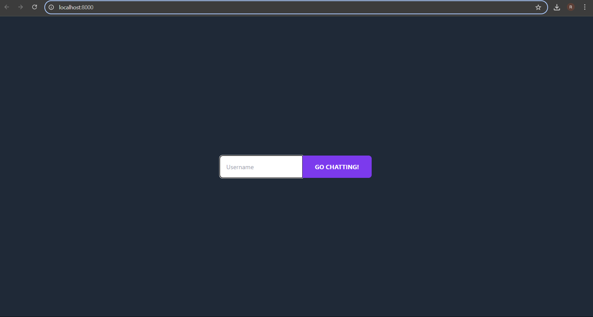
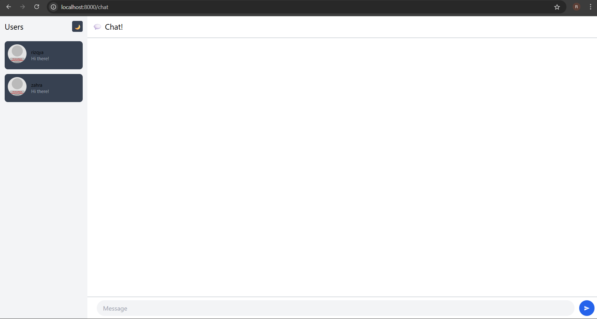
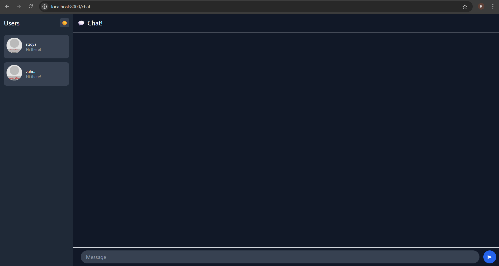

# Tutorial Module 10 Advanced Programming

Nama: Rizqya Az Zahra Putri

NPM: 2306244936

Kelas: B

## 3.1. Original code

Setelah menjalankan `npm start` pada YewChat dan Simple WebSocket Server, terlihat bahwa YewChat dapat berjalan dengan baik. Kita dapat login dengan nama user yang berbeda dan mengirim serta menerima pesan pada chat room.

## 3.2. Add some creativities to the webclient

Saya menambahkan toggle untuk mengubah tampilan antara light dan dark mode.